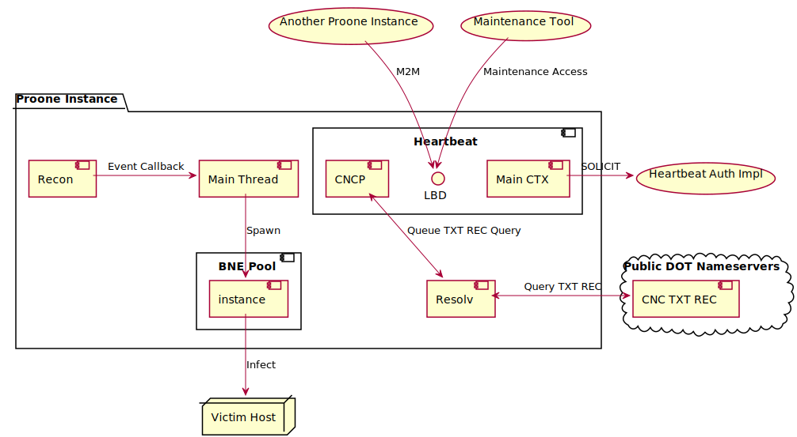

# Proone Software Design Spec
This document is part of **Proone Worm Project**. See [README.md](/README.md)
for overview.

Copyright (c) 2019-2022 David Timber &lt;dxdt@dev.snart.me&gt;

## Subsystems


The subsystems of Proone consist of the heartbeat worker, the recon worker, the
resolv worker and the bne worker pool. The recon and bne worker pool work
organically to infect other hosts whilst the heartbeat serves CNC instructions
and maintenance access.

Proone does not provide any "attack feature"(DDoS). Using the heartbeat
subsystem, the user may phase this feature in by

* patching Proone and upgrading binary of instances
* creating a separate program and running it on the hosts

### Heartbeat
**Heartbeat** is a subsystem of Proone that consists of a backdoor and CNC
mechanism on infected devices. **The Heartbeat protocol** is a point-to-point or
a broadcast framing protocol that works over a transport stream such as TCP/IP.
The subsystem is documented separately in [htbt.md](htbt.md).

### Recon
The role of the Recon(RCN) worker is to discover nodes both on the internet and
the link-local network. The worker instance takes a target network list and a
blacklist network list as parametres. */src/data/recon.samepl.conf* is the
sample lists for **proone-recon**, and `PRNE_RCN_T_IPV4`, `PRNE_RCN_BL_IPV4`,
`PRNE_RCN_T_IPV6` and `PRNE_RCN_BL_IPV6` macro defines are for hardcoded values
in Proone. The `PRNE_RCN_PORTS` macro defines the target remote remote TCP ports
the Recon worker sends fabricated SYN packets to. The worker sends fabricated
SYN packets to randomly generated IP addresses within the target networks.

At least one target network for each version of IP must be specified. You may
choose to target all networks by specifying 0.0.0.0/0 and ::/0 respectively. For
efficiency, you may specify the networks for special uses such as 127.0.0.0/8,
224.0.0.0/4, ::/128, ::1/128, 1::/64 and so on. You may or may not want to
blacklist private network addresses as devices sitting befine NATed networks.
Note that the NATed devices still can be controlled by TXT REC CNC. However,
NAT routers are usually low to mid-range devices so infecting too many devices
on the private network can put strain on the NAT router.

The SYN packets are sent with the special signatures the worker generates for
each iteration cycle. When a node responds with a SYN+ACK packet, the worker
then recognises the signature in the packet and invokes the callback function to
notify the user of the worker, the Proone main itself. Due to the nature of the
raw sockets used, the worker receives all the IP packets the host node receives.
The worker is able to distinguish the relevant packets from other traffic in and
out of the node with the signatures. The duration of one cycle is set to one
second plus minus the jitter. This effectively corresponds to the timeout value
as the worker would not recognise the signature it generated in the previous
cycle.

The crafted TCP packets sent using raw sockets are not managed by the kernel.
The kernel is required to send RST packets when it receives any TCP packets that
it does not recognise. For each SYN+ACK packet received(when the worker finds an
open port), there will be an RST sent back to the source node.

The Recon worker creates one raw socket for sending raw IP packets and another
for all the IP packets the host receives for each IP version. 4 sockets in total
will be created on a host that supports IPv6. Mirai uses only one socket for
sending and receiving raw packets. The reason Proone uses 4 is due to the
inconsistency with the `IP_HDRINCL` flag in the API(the Linux kernel does not
seem to support it for IPv6). Also, a different approach had to be used for
discovering IPv6 nodes because the address space of IPv6 is large. The only way
to achieve this is using 2 types of raw sockets for each IP version.

The link-local addresses assigned to the network interfaces by the system are
used as source addresses for multicasting probe packets to the link-local
network. In order to inquire these addresses, the platform-specific API
functions are used as this functionality is not covered by the POSIX. Especially
for IPv6, scope ids must be queried in order to use link-local addresses.

The Recon worker discovers the IPv6 nodes on the network by multicasting ICMPv6
ECHO packets with a bogus DSTOPT(0x9e, reserved for private experimentation).
All nodes on the network are required by the IPv6 spec to send an ICMPv6 packet
with type 4 and code 2 to notify the source node of the erroneous DSTOPT.
They're not allowed by the spec to process the ICMPv6 data in the packet The
Recon worker is capable of processing normal ECHO replies in case bad IPv6
implementations proceed to process the ICMPv6 part of the packet. Upon receiving
ICMPv6 4/2, the Recon worker then sends a TCP SYN to confirm that the node has
any of the targets port open.

References:

* RFC7707
* RFC4727
* https://www.iana.org/assignments/ipv6-parameters/ipv6-parameters.xhtml

### BNE
The Break And Enter(BNE) worker, as the name suggests, break-and-enters into the
target host using vulnerabilities. The basic credential dictionary("combo list")
based brute force login method is implemented. The interface can be extended so
that the worker supports other methods using known or zero-day remote code
execution vulnerabilities.

The worker is also responsible for M2M functions of Proone such as M2M binary
upgrade if the Heartbeat vector is enabled. With the vector enabled, the Local
Backdoor port on the target is be tried before actual abusive methods are tried
for efficiency. If the worker successfully establishes a TLS connection, it
means that the target host is running Proone(2-way certificate verification and
ALPN check. See [htbt.md](htbt.md) for more). The worker determines which of the
hosts should be updated. If the remote host is running an old version, the
worker will update the executable of the remote instance and vice versa by
performing binary recombination. This functionality can be disabled by making
the callback function always return 0.

Unlike the other workers which run as services, the BNE worker is more of a task
than a worker. The worker exits once the task is carried out - when the breaking
and entering process was successful, or all the vectors are tried. An instance
of the BNE worker is spawned whenever a callback is received from the RCN
worker. Multiple instances of the BNE worker can be run simultaneously(note that
these threads are not "real". Proone uses GNU Pth to limit its execution to one
physical thread). The maximum number of BNE workers is set to the arbitrary
magic number 128(`PROONE_BNE_MAX_CNT`). The chance of an instance reaching this
limit is rare. On most embedded devices, the process will run out of memory long
before reaching this limit. After a certain point, further attempts to spawn a
worker will fail with ENOMEM. Or it is possible that the BNE threads will start
suffering from starvation. For this reasion, the BNE workers have lowest
priority to minimise the starvation of other vital workers.

### Resolv
The Resolv worker is a DNS resolver specifically designed for Proone. It is
mainly used for TXT REC CNC.

Queries are based on the promise-future model. When a query is successfully
queued, the caller is given a future object that it can wait on using Pth
functions. The TCP connections to the name servers are kept open for a certain
amount of time after a query is processed. When there's a constant flow of
queries, say when the Heartbeat worker is processing a long stream of TXT
records, the same name server will be used so long as the server allows. When
the server returns an error or the connection drops whilst processing a query,
another hardcoded name server will be randomly selected from the pool in effort
to continue the process. Multiple servers can be involved for one query(this
fact becomes relevant when the changes made to the record is propagating among
the name servers around the world). If there's no internet connection, the
worker will circle through the name servers until the query times out. A short
connection timeout value is used to achieve this.

The Resolv worker supports basics only. It is capable of resolving TXT, A and
AAAA records. It does not depend on any system configuration. Only the harcoded
DoT public name servers are used and only the hardcoded TLS certificate and
private key are used to make it difficult to analyze packets exchanged between
the name servers and the process.

The worker sends the "close notify" SSL alert message when closing the
connection gracefully. Some DoT servers do not appreciate this and drops the
connection with RST right away. There is no side effect from this issue.

## Binary Archive and Data Vault
Proone aims to be a decentralised botnet. To spread without binary distribution
servers, Proone carries all the executables of arch types it supports. For this,
a special file structure is designed.

The **Data Vault**("**DVault**") is a binary block that contains large and
sensitive data necessary for operation of Proone. DVault is a kempt version of
the data table of Mirai. DVault also helps reduce the size of Proone. Each
executable contains the *.data* section. If there's a long string in the
program, the value of the string will end up in each *.data* section of the
executables. Compression leviates this issue but there's a limit because the
size of data dictionary blocks can only get big. Having a custom *.data* section
for large data solves this issue at the cost of the size of code for fetching
and unmasking values from DVault. This implies that, in some cases, storing
static values in the *.data* section of an ELF is efficient enough[^1]. Another
purpose of DVault is masking sensitive data like `PRNE_DATA_KEY_CNC_TXT_REC` and
`PRNE_DATA_KEY_CRED_DICT` so that they're not revealed when `strings` command is
run on the executable or when the process is core dumped. DVault is loaded when
Proone initialises. The loaded contents remain in memory masked and unmasked
only when needed.

The contents of DVault are XORed with a 256 byte array of random numbers
generated on each compilation. This process makes it impossible to compress the
DVault binary block because of high entropy. It's not a good idea to use DVault
to store exceptionally large values. This issue may be solved by compressing the
value separately at the cost of CPU time.

The **Binary Archive**("**BA**") is a binary block containing compressed
executables for various operating systems and CPU architectures. The executables
are compressed into a single stream of data. The executables are indexed by the
OS codes and arch codes. Each entry of the index is a tuple of the size and
offset in the uncompressed stream of the executables. A new copy of BA is
generated each time the instance performs binary recombination for the target
host.

## Binary Recombination
```
                     linux armv4t host targetting linux sh4

 ┌──────────────┐                                              ┌──────────────┐
 │              │                         ┌──── decompress ──> │              │
 │    E L F     │                         ╵                    │    E L F     │
 │ linux armv4t │ ────────────────────────────┐                │  linux sh4   │
 │              │                         │   │                │              │
 ├──────────────┤                         │   │                ├──────────────┤
 │    DVault    │ ───────────────────────────╴│╶───── copy ──> │    DVault    │
 ├──────────────┤                         │   │                ├──────────────┤
 │   BA index   │ ───────────────────────────╴│╶─── udpate ──> │   BA index   │
 ├--------------┤                         │   │                ├--------------┤
 │ linux sh4    │ ────────────────────────┘   └── compress ──> │ linux armv4t │
 │ linux i686   │ ───────────────────────────── recompress ──> │ linux i686   │
 │ linux mips   │ ───────────────────────────── recompress ──> │ linux mips   │
 │ linux mpsl   │ ───────────────────────────── recompress ──> │ linux mpsl   │
 │ linux ppc    │ ───────────────────────────── recompress ──> │ linux ppc    │
 │ linux m68k   │ ───────────────────────────── recompress ──> │ linux m68k   │
 └──────────────┘                                              └──────────────┘
```

The Proone executable is a regular ELF file with extra binary data appended to
it. Proone parses its own executable in order to locate the appended data during
the initialisation process. Having located the data, Proone then proceeds to
load the DVault and the binary archive(BA). The offsets to these are kept in
memory and used to initiate binary recombination later on.

Binary Recombination is a process of preparing the executable for the target
host after a successful breaking and entering. If the host is of the same
platform(arch and OS), the executable of the host is simply copied to the target
host. If the target host is a different platform and the BA contains the
executable for that platform, a process is initiated for creation of the
executable for the target host:

* The executable for the target platform is extracted from the archive
* The DVault is appended to the executable
* The new BA to be appended is generated - the host executable is compressed
  with other uncompressed executables in the BA

The diagram above summaries the case when the host platform is linux/armv4t and
the target platform is linux/sh4. The compressed stream of executable is
uncompressed and compressed again each time a true binary recombination occurs.
This is to maximise the entropy and avoid the overhead from having many streams.

Proone supports ELF only. Note that Proone cannot run if it fails to load
DVault. Being unable to parse the executable is fatal. Should different
executable formats such as COFF and PE be used, parsing of those formats must be
implemented.

## IPv6
Proone is IPv6 ready. The Resolv worker supports IPv6 public DNS over TLS
servers. The Recon worker supports discovery of IPv6 hosts on the network and
IPv6 network targets.

Proone always favours IPv6 connectivity. Whenever the instance connects to the
public DNS over TLS servers or an authoritive heartbeat host, it attempts to
establish both IPv4 and IPv6 connection. If both connections are established,
the instance drops the IPv4 connection and uses IPv6 connection. The minor issue
with this approach is when the IPv6 handshake process takes a little longer than
that of IPv4. The instance will choose to use the IPv4 connection even though
the IPv6 handshake would have completed. The reasons for designs are ...

* IPv6 is relatively a new technology. The assumption is that the most network
  administrators overlook the IPv6 configuration
* IPv6 offers more load-balancing mechanisms like RA and RH
* Under the assumption that the connection will the least latency and congestion
  will finish the handshake process
* It saves the step of checking connectivity for each IP version(using
  `getsockname()` or `gethostinfo()`)

## Requirements
### Targetting Wide Range of Devices and Kernel Configurations
A number of methods has been employed in efforts to target a wide range of Linux
devices. The assumption is that there are still devices running old images of
Linux and targetting these devices means coding up to the standard of old POSIX
specs and testing under old versions of Linux(namely 2.6.x).
`_POSIX_C_SOURCE=200112L` macro is defined to meet this requirement. Note that
using this macro does not give you an error when you accidentally use APIs not
in the 200112L standard. The compiler will only give you a warning and your code
will compile just fine. If you happen to use a function that the kernel of the
host does not support, the syscall will fail with `ENOSYS`. If the feature
requiring the new API can be silently switched off at runtime, removal of the
macro is recommended.

The Linux kernel is highly configurable. Pesudo file systems and the device file
system may not be present on a Linux host since they can be disabled. Disabling
any of these file systems is unusual for PCs but practical on embedded devices.
Proone do not assume that these file systems are available on the host and try
to run without using them if not available.

### Running Lean
Proone is designed under the assumption that honouring other processes on the
system will decrease the change of getting caught by system administrators.

Proone is compartmentalised so that it's somewhat immune to syscall fails. This
design is to counter `ENOMEM` as it runs lean on lean embedded systems. This
implies that proone can be initialised "half-complete". For example,
it can be initialised with all the workers running except the Heartbeat worker.
In this case, proone will be able to infect other devices on the network
while unable to respond to CNC TXT REC. Another notable case would be an
instance running without the Recon worker. It will respond to the CNC TXT REC
and serve the local backdoor connections while unable to infecting the other
devices on the network. Proone does not reattempt to start the workers it failed
to run on start. The assumption is that the system is already running with its
memory full to the brim and it's futile to wait for resource it failed to claim
as it's likley that the other services on the system will claim the reource at
some point.

Proone does cooperative multitasking by using **Pthsem** library. This is one
of many efforts to "run lean" whereby restricting CPU usage to one logical
thread. This may seem as a huge missed opportunity if Proone scores infecting
itself onto a beefy multi-core system. Keep in mind that Proone is designed to
run on resource-scarce embedded devices. Most poorly-designed vulnerable devices
will be single core, anways. The strategy is getting the most small-powered
devices infected rather than having a few infected high-performance systems.

### Ephemeral Presence
Just like Mirai, Proone makes no attempt to seek permanent residency on the
device. There are many reasons for this. The major one is to make it hard to
capture the executable from the device. Both Mirai and Proone delete their
executable as soon as the process starts so that the only way to retrieve the
executable is through inspecting the file system the executable had been
uploaded to or making a core dump of the process or the entire system. It is
difficult to do the latter because it requires development tools and the kernel
has to support core dumps on the device. Ordinary embedded devices are not
equipped for this. It would have been impossible to capture the executable of
Mirai running in the wild.

Proone takes it up a notch and makes it even more difficult. The BNE worker is
programmed to use only tmpfs and devtmpfs mount points for the upload location
whereas the Mirai loader, the program responsible for uploading the botnet
executable to the host, looks for any read-writable mount points. By using only
memory-backed file systems, Proone eliminates the change of traces of the
executable being left on non-volatile storage devices. The executable size of
Proone is quite big since it carries executable for other platforms. On most
embedded devices, the size of SPI flash memory is small while the RAM is
reletively spacious. So it would be unwise to use just any mount point.

## Dependencies
The dependencies for Proone have been kept to absolute necessities. libssh2 is
used for the SSH brute force vector. Coupled with libssh2's SSL backend is
Mbedtls for TLS connection to public name servers and the Heartbeat protocol.
zlib is used to implement binary archive. All the libraries are compiled with
default configurations. Pthsem is used for threading.

libyaml and mariadb-connector-c-devel is required to build hostinfod. YAML has
been chosen for the configuration file format and output format of
proone-htbtclient. MariaDB for DB backend.

## Files and Directories
### Directories
* /doc: documentation root directory
* /doc/puml: PlantUML source files
* /doc/img: images used in documentation
* /templates: (undocumented)
* /src: source root directory
* /src/data: program data and configuration
* /src/data/proto: (undocumented)
* /src/data/sql: SQL files
* /src/proone_conf.skel: skeleton Proone instance data and configuration header
* /src/proone_conf: Proone instance data and configuration header for build
* /.vscode: Visual Studio Code configuration
* /scripts: main shell scripts
* /builds: /scripts/build-all.sh script output directory
* /builds/misc: miscellaneous testing tools for target host arches
* /builds/tools: tools for build host
* /builds/proone.bin: Proone instance executables, ELF only
* /builds/debug: executable debugging symbols
* /builds/proone: deployable Proone instance executables

### Executables
* /src/proone: Proone instance executable with DVault only
* /src/proone.bin: Proone instance executable ELF part only (not runnable)
* /src/proone-bne: standalone bne tool for testing and deployment of an index
  case(P0)
* /src/proone-hostinfod: hostinfo daemon, an example of authoritive heartbeat
  implementation
* /src/proone-htbtclient: heartbeat client, Proone instance maintenance tool
* /src/proone-htbthost: standalone heartbeat worker for testing
* /src/proone-ipaddr-arr: tool for converting ip address strings to C arrays
* /src/proone-list-arch: (undocumented)
* /src/proone-mkcdict: credential dictionary build tool
* /src/proone-mkdvault: DVault binary build tool
* /src/proone-pack: binary archive build tool
* /src/proone-recon: standalone recon tool for testing
* /src/proone-resolv: standalone resolv tool for testing
* /src/proone-rnd: uniform pseudorandom number generator testing tool
* /src/proone-stress: CPU stress tool (no FPU use)
* /src/proone-test_bitfield: test suite for variable-length bitfield
* /src/proone-test_iobuf: test suite for byte vector for input/output buffer
* /src/proone-test_proto: project protocol test suite
* /src/proone-test_util: test suite for util functions

### Data and Configuration
* /src/cred_dict.bin: credential dictionary build output in binary format
* /src/dvault.bin: DVault binary build output
* /src/proone_conf/cred_dict.txt: credential dictionary used for build
* /src/proone_conf.skel/cred_dict.txt: placeholder
* /src/data/cred_dict.sample.txt: credential dictionary sample
* /src/data/hostinfod.conf.sample: hostinfo daemon sample configuration
* /src/data/recon.sample.conf: standalone recon tool sample configuration

### Source
* /src/bitfield.c: variable-length bitfield
* /src/bitfield.h: variable-length bitfield
* /src/bne.c: break and Entering worker
* /src/bne.h: break and Entering worker
* /src/config_gen.h: project build configuration (Autoheader)
* /src/config.h: project environment configuration
* /src/cred_dict.c: credential dictionary
* /src/cred_dict.h: credential dictionary
* /src/data.h: DVault key enum
* /src/dvault.c: data vault
* /src/dvault.h: data vault
* /src/endian.h: host endianness
* /src/htbt.c: heartbeat worker
* /src/htbt.h: heartbeat worker
* /src/imap.c: integer-key ordered binary map
* /src/imap.h: integer-key ordered binary map
* /src/inet.c: project-specific internet protocol utils
* /src/inet.h: project-specific internet protocol utils
* /src/iobuf.c: byte vector for input/output buffer
* /src/iobuf.h: byte vector for input/output buffer
* /src/iset.c: integer set
* /src/iset.h: integer set
* /src/libssh2.c: project-specific libssh2 utility functions
* /src/libssh2.h: project-specific libssh2 utility functions
* /src/llist.c: linked-list
* /src/llist.h: linked-list
* /src/mbedtls.c: project-specific mbedtls utility functions
* /src/mbedtls.h: project-specific mbedtls utility functions
* /src/pack.c: packaging facilities for binary archive and nybin
* /src/pack.h: packaging facilities for binary archive and nybin
* /src/proone-bne.c: standalone bne
* /src/proone.c: Proone instance
* /src/proone.h: Proone instnace
* /src/proone_conf.skel/config.h: domain-specific configuration
* /src/proone_conf.skel/x509.h: domain-specific PKI data
* /src/proone-hostinfod.c: hostinfo daemon
* /src/proone-htbtclient.c: heartbeat client
* /src/proone-htbthost.c: standalone heartbeat worker
* /src/proone-ipaddr-arr.c: tool for converting ip address strings to C arrays
* /src/proone-list-arch.c: (undocumented)
* /src/proone-mkcdict.c: credential dictionary build tool
* /src/proone-mkdvault.c: DVault binary build tool
* /src/proone-pack.c: binary archive build tool
* /src/proone-recon.c: standalone recon tool
* /src/proone-resolv.c: standalone resolv tool
* /src/proone-rnd.c: uniform pseudorandom number generator testing tool
* /src/proone-stress.c: CPU stress tool (no FPU use)
* /src/proone-test_bitfield.c: test suite for variable-length bitfield
* /src/proone-test_iobuf.c: test suite for byte vector for input/output buffer
* /src/proone-test_proto.c: project protocol test suite
* /src/proone-test_util.c: test suite for util functions
* /src/protocol.c: project protocols including heartbeat
* /src/protocol.h: project protocols including heartbeat
* /src/pth.c: project-specific util functions for GNU Portable Threads
* /src/pth.h: project-specific util functions for GNU Portable Threads
* /src/recon.c: recon worker
* /src/recon.h: recon worker
* /src/resolv.c: resolv worker
* /src/resolv.h: resolv worker
* /src/rnd.c: uniform pseudorandom number generator interface
* /src/rnd.h: uniform pseudorandom number generator interface
* /src/rnd_well512.c: Well Equidistributed Long-period Linear 512-bit variant
  pseudorandom number generator implementation
* /src/strmap.c: string-key ordered binary map
* /src/strmap.h: string-key ordered binary map
* /src/util_ct.h: project compile-time utility functions
* /src/util_rt.c: project runtime utility functions
* /src/util_rt.h: project runtime utility functions

### Scripts
* /bootstrap.sh: Autotools set up script
* /gen-copying.sh: script for generating COPYING in various formats
* /scripts/build-all.sh: script for building Proone for deployment
* /scripts/build-arch.sh: script for building one arch target
* /scripts/do_symsize.sh: (undocumented)
* /scripts/extsymsize.sh: (undocumented)
* /src/build-utils.sh: file alignment tool used by Makefile recipe
* /src/data/proto/print-raw.sh: (undocumented)
* /src/data/sql/hi-create.sql: MariaDB schema for hostinfo daemon
* /src/proone-txtrec-del.py: CNC TXT REC deletion tool
* /src/proone-txtrec-set.py: CNC TXT REC set up tool
* /src/run-tests.sh: (undocumented)
* /src/test-resolv.sh: test suite for resolv worker

## Footnotes
[^1]: i.e. representing values in code: `int value = 123;`
